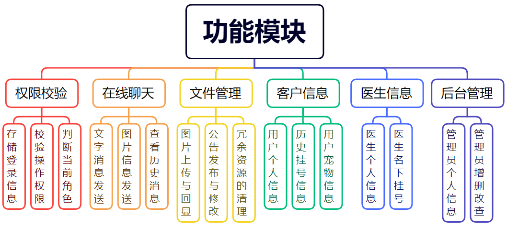
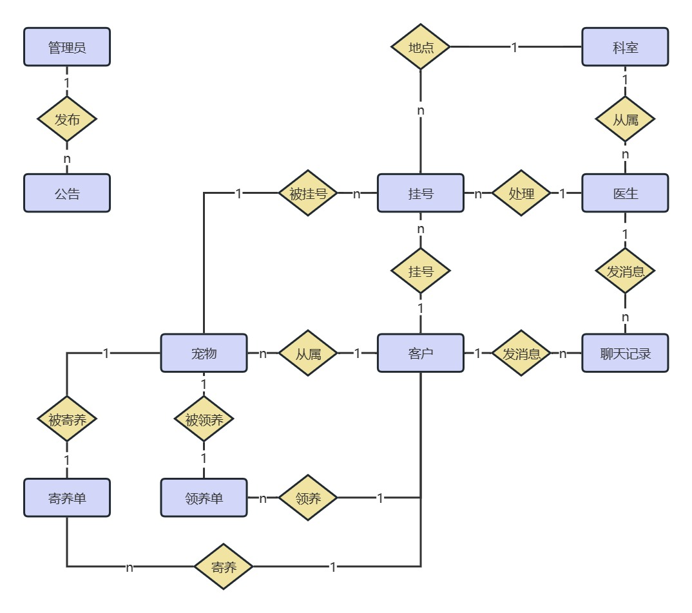
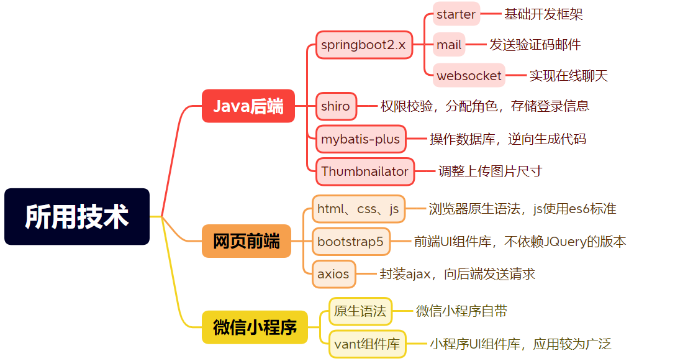

# 论文草稿

> 这只是一个草稿，为了毕设说明书的文字部分而准备

## 摘要

近些年来，宠物医院发展得相当快速，但仍有一部分宠物医院处于手工管理阶段，这为信息管理带来了极大的不便。因此，一个基于JavaWeb的宠物医院信息管理系统可以大大的改善传统手工管理的消息陈旧、更新困难、不便于实时联系等种种弊端。这无论是对于宠物的饲养者，还是医院管理人员来说都提供了很大的便利性。

本系统是基于JavaWeb的宠物医院管理系统，使用Web浏览器或者微信小程序就可以使用本系统，进行对系统各种信息的操作。同时本系统提供部署教程，无论是医院的医护人员还是专业的网络运维，均可参考本说明书自行进行部署与后续维护。该系统采取MVC框架模式，以及前后端分离架构。采用Java进行后端开发，利用springboot集成各种后端框架，利用原生js与bootstrap前端UI库完成系统页面的编写，利用vant组件库与小程序原生语法完成小程序端的开发。使用MySQL数据库存储数据，最后使用spring自带的tomcat服务器完成网站发布。

本系统实现了用户查看个人及网站相关信息、管理员对系统的各种信息进行增删改查、医生与用户进行在线聊天等功能。

## 目录

[TOC]

# 一、绪论

## 1.1 研究背景及意义

1. 随着经济的发展，人们生活水平不断地进步和提高，越来越多的家庭开始饲养宠物。于此同时，宠物的卫生、防疫、诊疗也逐渐得到了人们的关注，因此近些年来，宠物医院得到了充分的发展，越来越多的宠物医院如雨后春笋般冒了出来。但在宠物医院发展的背后，仍然有许多宠物医院仍处于手工管理阶段，这为信息管理带来了极大的不便。同时使用手工管理也容易导致信息错误、更新不及时等问题。因此，一个基于JavaWeb的宠物医院信息管理系统可以大大的改善传统手工管理的消息陈旧、更新困难、不便于实时联系等种种弊端。无论对于宠物的饲养者，还是医院管理人员来说都提供了很大的便利性。

2. 一个完善的宠物医院管理系统对医疗卫生信息化的建设具有重要的意义，既能提高医院的服务质量，又能方便医院的统一管理，减少人力物力的浪费，能够让用户能够更加方便、快捷、准确的了解自己的宠物。形象直观的展现了宠物的各类状态，拉近了人与宠物的距离。


## 1.2 国内外研究现状及进展

1.  在当今社会，世界各国对于信息的需求也越来越高，信息技术和信息产品广泛的应用于各个国家、地区、企业、家庭、个人。早在20世纪80年代，发达国家就已经开始信息化建设工作。目前，欧美国家早已完成针对于宠物的信息化管理，建立了宠物电子档案，在宠物管理上实现了规范化、标准化。

2.  相比较于欧美的发达国家，我国的信息化建设从20世纪90年代初开始，信息化程度较发达国家而言比较落后，且发展很不平衡，仍有很多的工作在使用人工操作，极大的影响了当前宠物医院的信息化的管理。随着我国信息技术在宠物医院行业应用程度的不断提高，东南沿海较发达城市已经实现了宠物医院管理的信息化，但是并没有完全普及，仍有一些小型宠物医院使用传统的管理方式。虽然目前仍与欧美发达国家存在差距，但“十二五”规划，我国提出了医疗卫生信息化的“3521工程”（即：建设国家级、省级和地市级3级卫生信息平台），我国宠物医院的信息化建设迎来了发展的好时机。

## 1.3 论文结构

本文的内容大致分以下六个章节来对该系统的设计与实现过程进行说明，包括：

1. 绪论。本文章的开头部分，阐述本系统的研究背景及意义，以及国内外的研究现状。
2. 系统分析。分析本系统所需要实现的具体需求，以及开发过程中可能遇到的问题。
3. 系统设计。本文章的重要部分，提供了系统架构的详细设计和一些主要功能模块的设计说明。
4. 系统实现。主要对本系统所使用的相关技术及相关框架进行说明，以及设计思想。
5. 系统部署及运行。主要介绍如何快速对系统进行部署，以及如何修改系统的一些自定义参数。
6. 总结与展望。对开发本系统的过程以及最终成果做出总结，以及未来的完善方向。

---

# 二、系统分析

## 2.1 宠物医院的初步调查

宠物医院的初步调查主要通过走访观察现有的宠物医院、上网查阅资料的形式展开。

经过几天的初步了解，最后得出结论如下：目前宠物医院的规模都不大，大部分的宠物医院坐落于小区旁，以小店的形式进行营业，这种往往只有一两个医生，只提供三至五个专科；少部分的宠物医院位于一些较繁荣的社区，以营业厅的形式进行营业，一般有一两层，其中值班的医护人员目测不少于七个。目前大部分宠物医院都实现了信息化管理，但仍有部分小店在使用传统的手工记录。

## 2.2 系统功能需求

通过对宠物医院的初步调查、以及从自身作为使用者的角度出发，大致得出本系统的以下几个需求 ：

1. 本系统使用者应分为三种角色，分别对应用户、医生、管理员，这三种角色在系统中行使不同的功能，它们应该具有不同的需求。
2. 用户：用户的需求主要是查看医院的部分信息和自己的相关信息。同时，应该给用户额外开发一个微信小程序的前台界面，以便用户能够随时随地的访问前台网站，以及向医生发起咨询或求助。
3. 医生：主要有三个需求，分别是处理挂号单、回答由用户所发起的咨询或求助、以及查看和修改医生的个人信息。需求较为简单。~~因为这里的“医生”指的只是坐在医务室处理宠物病情的人员，~~其它的一些事务，比如挂号、录入宠物信息等，由管理员这一角色负责。
5. 管理员：要求能够对后台的数据进行增删改查，例如发布公告、修改宠物信息。同时为了保证数据的安全，防止数据被误修改。应该对管理员进行角色权限的区分，不同的角色应该具有不同的权限。

### 2.2.1 客户端功能

1. 用户要能够通过**电脑的网页端**或**手机的小程序端**访问到医院的网站，同时，用户在不登录的状态下为游客模式，只能看到部分的公开信息。
2. 用户要能够看到最新发布的三条公告，以及所有待领养的宠物信息，和现在正在医院寄养的宠物信息。
3. 用户要能够看到当前医院的医生信息，包括他们的工号、照片、年龄、简介，以及医生当前的挂号占用情况。
4. 用户要能够直接向医生发起实时聊天，进行咨询、求助。同时医生不在线时，要能够将信息保存在聊天记录。
5. 用户要能够查看自己的个人信息并对其进行修改，同时用户要能够查看自己的宠物信息，以及自己名下的挂号单详情。
6. 用户可以重置密码，或者在未登录的情况下进行注册，为了确保隐私以及数据安全，这些操作都要通过邮箱发送验证码的方式进行校验。

### 2.2.2 医生端功能

医生的设计大致与用户相同。

1. 要能够对自己当前挂号单进行处理，以向医院的前台发送反馈。
2. 要能够回答用户发起的在线咨询，这里的前端设计以及后台逻辑与用户端相同。
3. 能够修改自己部分的个人资料，以及通过邮箱发验证码的形式重置密码。

### 2.2.3 管理员端功能

1. 管理员要能够对用户、宠物、挂号、医生、领养、寄养、公告、科室、管理人员等信息进行增删改查。
2. 为了方便控制权限，应该分为三种身份，分别为**超级管理员**、**普通管理员**、**普通员工**。其中**超级管理员**对应现实医院里的**院长**，应该具有后台管理系统的全部权限。而**普通管理员**则对应现实医院中的**主任**，应具有除了人员任命、科室变动以外的全部权限。最后是**普通员工**，对应现实里的**护士**。只具有部分表的新增权限（诸如挂号、宠物信息录入），而无修改与删除权限。
3. 管理员在新增**部分涉及到多表操作的信息**时，应该有一个即时搜索、模糊匹配的功能。如进行挂号操作时，输入“李”，会弹出“李四”、“李耳”、等所有带“李”的选项。选择用户名之后，下一栏的宠物名称输入栏应只对该用户名下的宠物进行匹配。
4. 同时，由于管理员在不同网页之间的操作过于相似，都是基本的增删改查，以至于大部分操作中，只有表的字段不同，而其它完全一致。故应当在开发的过程中，尽可能的抽离重复代码，封装为公用组件，以达到减少代码复用效果。

## 2.3 经济可行性分析

本系统的所用的开发工具中，mysql、git、maven、java以及java的第三方库，都是免费开源的。

而所使用的Java集成开发环境 IntelliJ IDEA旗舰版虽然是收费的，但可以通过开源项目开发者的身份向JetBrains公司申请免费使用一年的许可证，从而达到免费使用的效果。

微信小程序的扫码登录功能需要一台服务器和一个https协议的域名，服务器可以通过内网穿透进行解决，但免费版的内网穿透只能提供http的域名，如果映射https的域名则每个月需要支付10块钱左右。而如果将扫码登录换成手机验证码，又要向短信平台购买会员。因此在登录校验这一块，最终决定使用电子邮件来进行验证码发送，使用账号密码的方式进行登录，这样可以节省这笔支出。

微信小程序的开发者工具是免费使用的，但如果想在手机上通过小程序连接后端，也需要服务器和https域名。因此，本系统的小程序端，只在微信开发者工具中进行演示，以避免不必要的支出。

因此，本系统开发的过程中，不需要任何的金钱花费。而如果最终需要将本系统上线运行，则需要租用一台云服务器，以及购买一个专属域名，这样一年的花费约在150元左右。故该系统在经济分析上，是可行的。

## 2.4 系统业务流程分析（未完待续）

对宠物医院的各种业务流程进行分析。

---

# 三、系统设计

## 3.1 系统功能模块划分

本系统主要划分为以下模块：权限校验模块、在线聊天模块、文件管理模块、客户信息模块、医生信息模块、后台管理模块。

1. 权限校验模块：主要用于不同角色的登录、注册、密码找回。以及存储当前登录的角色信息、判断当前操作是否具有角色权限等。
2. 在线聊天模块：用于用户与医生的在线聊天，包括了在线发送文字消息、在线发送图片、查看聊天历史记录。
3. 文件管理模块：包括了图片上传与回显、发布和修改公告、清除冗余文件资源。
4. 客户信息模块：用户的个人信息、历史挂号信息、用户名下的宠物信息等。
5. 医生信息模块：医生的个人信息、医生名下的挂号等。
6. 后台管理模块：管理员对后台的信息进行操作，如对用户、宠物、挂号、医生、领养、寄养、公告等信息进行增删改查。



## 3.2 数据库设计

数据库的设计是一个管理系统的核心与基础。在设计数据库时，根据管理系统的一些基本流程以及功能模块划分，制定了如下十张表：

### 3.2.1 表的基本字段

> 十张表的基本字段

1. 领养表(adopt)：领养表id、订单编号、领养宠物的id、领养人id、领养押金、订单备注、是否通过
2. 挂号表(appointment)：挂号单id、用户id、宠物id、就诊时间、部门id、医生id、挂号简短信息、是否处理
3. 客户表(client)：客户id、账号、密码、姓名、性别、电话、生日、简介、照片名称
4. 科室表(department)：科室id、科室名称、科室简介、科室地址
5. 医生表(doctor)：医生id、部门id、工号、姓名、性别、生日、照片名称、联系方式、职位、简介、密码
6. 管理员表(employee)：管理员id、账号、密码、姓名、管理员等级、联系方式、照片名称
7. 寄养表(foster)：寄养表id、订单编号、寄养宠物的id、寄养人id、寄养到期时间、寄养押金、订单备注
8. 聊天记录表(msg)：记录ID、客户ID、医生ID、是否客户发送、消息内容、是否为图片消息
9. 公告表(notice)：公告id、公告标题、文本文件名称、创建人id、修改人id、是否禁用
10. 宠物表(pet)：宠物id、宠物姓名、宠物品种、性别、生日、宠物状态、宠物主人id、宠物照片名称

### 3.2.2 表的公共字段

为了更好的展示、了解每一条信息，每张表都有三个公共字段，分别是：

1. 更新时间，即当前数据更新时间，若该数据一直没有被修改，则与创建时间相同。
2. 创建时间，即当前数据的创建时间，在一些表中，如挂号表中，代表了挂号时间。
3. 逻辑删除，默认为0，表示没有删除；当进行逻辑删除时，将这个字段变为逻辑删除的时间。同时这个字段在部分表中(例如用户表、管理员表)，与一些诸如账号、工号之类的字段，一同构成唯一索引。

### 3.2.3 数据库E-R图

系统数据库的E-R图，如图所示：



## 3.3 界面设计（未完待续）

系统的整体界面设计通过bootstrap前端UI库来实现响应式的布局，以及做到风格上的统一。

小程序端的页面设计则力图简洁，以期在有限的页面上展示最主要的信息。

### 3.3.1 登录页面设计

登录页面采取卡片样式，运用css卡片翻转的效果，将用户登录、用户注册、用户找回密码、管理员登录、医生登录这五个入口放在一个页面内，大大减少代码的重复，效果上更加地赏心悦目，同时也更加方便用户进行操作。

卡片正上方的猫头图标是宠物医院的logo，点击这个图标可以切换到管理员登录的入口，这样做也是为了隐藏管理员登录的入口，防止用户误入。

同时这个卡片也使用了响应式布局，即：将浏览器缩小，这个卡片的宽度会随着浏览器的缩小而放大。当浏览器的宽度小于500px时，卡片的宽度会占据页面宽度的90%，这是为了防止将浏览器缩小的时候，会出现看不清页面的情况。


### 3.3.2 用户主页的设计

主页设计宗旨是，在一个页面展示所有不需要登录就能看到的信息，力图让未注册登录的用户可以通过主页了解本系统的页面风格，以及了解当前医院的一些基本信息。

主页最上面的导航栏上的链接除了"网站公告"以外，都通往用户的个人中心，如果是没有登录的情况会重定向跳转到登录页面。这个导航栏也是响应式布局，在浏览器缩小时，右边的四个链接会隐藏起来，同时会显示一个按钮，点击这个按钮会调出下拉框以使用那四个隐藏起来的链接。

主页上方的轮播图有三个，每5秒会进行轮换，其上的文字部分会展示医院的服务宗旨、服务理念、宠物的小贴士，同时会有相应的背景图。

网站公告则选择模态框的方式进行展示公告内容，以做到不跳转网页就能看到全部内容。

主页的内容卡片一样采用响应式的设计，不过不像登录页面那样单纯增加宽度，而是随着浏览器的缩小调整布局，比如原来一行会显示四个宠物的卡片，在浏览器缩小时，会变成一行显示两个，甚至一行只显示一个宠物的卡片。

为了方便展示，主页的截图为截长图模式。


在用户已登录的情况下，将鼠标悬停在导航栏中间的头像，会弹出个人资料卡片，展示当前登录的用户信息。同时点击卡片上除了“退出登录”以外的选项也可以跳转到对应的页面，这是为了让整个界面的设计更加简洁与具有交互性。而点击“退出登录”的选项之后，会在退出登录状态之后，以游客的身份继续留在主页。


### 3.3.3 管理员后台界面设计

管理员的后台界面是该系统在开发过程中，开发时间最长的部分。但大部分的开发时间其实并不是消耗在在编写页面上，而是在耗在了不断精简代码的过程中。经过不断的抽离重复代码，譬如将重复的页面元素通过iframe抽到统一的父页面，将重复的逻辑以及依托这些重复逻辑的页面元素封装到js文件。现在单个页面的代码行数已从原来的500多行，降到现在的最少83行，最多200行的大小了。

页面上方导航栏正中间的按钮是通往管理员个人中心的入口，这个按钮上的文字是当前管理员的用户名，点击以后会唤出一个弹窗显示管理员的个人资料，管理员可以在自己的个人资料的页面修改自己的个人资料。同时，管理员个人资料的入口旁边也有科室管理、员工管理这个两个只有超级管理员才能操作的页面的入口。

导航栏在响应式布局方面与用户端主页导航栏一样，在浏览器缩小时会隐藏上面的链接，同时提供一个能唤出下拉框的按钮。

在导航栏下面的是后台管理的核心页面，首先是一个搜索框，可以根据搜索框中的内容进行模糊匹配。搜索框旁边的是切换搜索对象的按钮，比如当前搜索的是宠物名字，点击之后可以切换为搜索主人名字。这里的搜索逻辑在后端是联合搜索、模糊匹配，但是为了界面的美观，在前端只显示一个搜索框。

在搜索框右边是添加与批量删除，其下是显示当前操作信息对象的表格，可以在表格的行内对单个数据进行操作。

在最下面的是自己定义的分页条，可以跳转页面与设置页面大小。这个分页条由于每个页面都有但又必须保持在最后一行数据的下方，所以封装在js文件之中，在每次页面的初始化时进行写入。


### 3.3.4 小程序端的界面设计(未完待续)

# 四、系统实现

本项目基于java17所运行，里面大量使用了java17的新特性 ~~(相对于jdk1.8)~~

## 4.1 开发环境及工具

| 开发工具       | 版本         | 简介                 |
| :------------- | :----------- | :------------------- |
| java           | 17.0.2       | 许多方便的新特性     |
| git            | 2.38.0       | 监控、回滚代码       |
| maven          | 3.8.6        | 管理java的第三方库   |
| IntelliJ IDEA  | 2022.2.1     | 编写、运行本项目     |
| mysql          | 5.5.40       | 数据库，存储数据     |
| navicat        | V8.2.1       | 可视化工具，mysql    |
| 微信开发者工具 | 调试库2.19.4 | 开发、运行微信小程序 |
| node.js        | v16.18.0     | 用于下载vant组件库   |

## 4.2 主要实现所用技术



* 后端框架:

> 基于java17

| 名称          | 版本   | 描述                       |
| :------------ | :----- | :------------------------- |
| SpringBoot    | 2.7.5  | 集成了web、邮件、websocket |
| mybatis-plus  | 3.5.2  | 操作数据库、生成模板代码   |
| shiro         | 1.10.1 | 安全校验、权限控制         |
| thumbnailator | 0.4.18 | 压缩图片                   |

* 网页前端框架：

> 原生js、es2021语法

| 名称      | 版本    | 描述                         |
| :-------- | :------ | :--------------------------- |
| axios     | v0.18.0 | 封装ajax，基于Promise        |
| bootstrap | v5.1.3  | 响应式框架，v5版不依赖jQuery |

* 小程序端：

| 名称       | 版本   | 描述               |
| :--------- | :----- | :----------------- |
| vant-weapp | 0.5.29 | 微信小程序的组件库 |

# 五、系统部署及运行

* 注册或者找回密码时的邮箱应该填写真实的邮箱，因为要发送验证码

## 5.1 部署教程

> 如果想在其他的电脑运行，有三点要注意，分别是：数据库、资源文件夹、邮箱

### 5.1.1 需要修改的参数

> 打开项目中`forgePet/src/main/resources`文件夹的`application.yml`文件，以下使用"配置文件"来指代该文件

*配置文件中可能需要修改的参数*

```yml
spring:
  datasource:
    driver-class-name: com.mysql.cj.jdbc.Driver
    url: jdbc:mysql://localhost:3306/pet_forge?useSSL=true
    username: root # mysql用户名
    password: root # mysql密码
  mail:
    host: smtp.qq.com
    port: 587
    username: 2231973602@qq.com # 发送者的邮箱，必须是QQ邮箱
    password: dspwtwceobsfeafa # 发送者邮箱的授权码
    default-encoding: UTF-8
```

*以及资源文件夹的路径：*

```yml
pet-forge:
   images-path: C:\MixJade\MixPet\images\ # 照片存储路径
   notice-path: C:\MixJade\MixPet\notice\ # 公告存储路径
   chatImg-path: C:\MixJade\MixPet\chatImg\ # 聊天图片存储路径
```

*以下为修改教程：*

1. 数据源的设置
    * 配置文件中：`spring.datasource`下的`username`以及`password`分别为mysql的账号和密码，必须改成自己的
    * 然后去mysql中新建数据库，数据库建议命名为`pet_forge`，数据库属性如下：
        * 字符集为`utf8 -- UTF-8 Unicode`(为了节省空间，我不打算为了emoji而使用utf8mb4)
        * 排序规则为`utf8_general_ci`(意为：不区分大小写，这样比较快)
    * 接着在`pet_forge`数据库下，运行本项目中`数据库备份`文件夹下的`pet_forge.sql`文件，以导入项目数据
    * 注意：配置文件中`spring.datasource.url`为数据源，其中`pet_forge`为数据库名,
    * 如果你不将数据库命名为`pet_forge`，这里记得修改
2. 资源文件夹的路径(绝对路径):
    * 如果不想改配置文件，只需在C盘下新建名为`MixJade`的文件夹，
    * 再在`MixJade`中新建名为`MixPet`的文件夹，然后将本项目放入`MixPet`即可
    * 如果需要自己配置资源文件夹：
        * 将本项目中的`chatImg`、`notice`、`images`文件夹放在自己配置的资源文件夹中
        * 然后修改配置文件中`pet-forge`属性之下的三个文件夹路径为自己的资源路径即可(一定要用绝对路径)
3. 验证码的发送邮箱(mail.username)与对应授权码(mail.password)
    * 登录QQ邮箱网页版，点击`设置`-`账户`-`开启服务： POP3/SMTP服务`
    * 按照提示操作，开启服务并得到授权码
    * 之后将配置文件下的`spring.mail`中的`username`和`password`改成自己的邮箱与授权码即可

---


### 5.1.2 运行微信小程序
> * 在启动微信小程序之前，记得先启动本项目的java后端
> * AppID自行去微信公众平台注册获取

* 打开微信开发者工具，选择`导入项目`，选择本项目之下的`forgePetWX`文件夹
* 输入自己的AppId，勾选`不使用云服务`。(建议百度：`微信小程序appid如何申请`)
* 在本地java项目的运行状态下，在微信开发者工具中编译运行小程序即可
* 注：如果一直无法登录，在微信开发者工具中，打开`详情`--`本地设置`，勾选`不校验合法域名`

---

## 5.2 运行教程

> 请确保你已安装了IDEA与maven，并且成功部署本项目

### 5.2.1 启动Java后端

1. 在IDEA中打开本项目中的forgePet文件夹
2. 点开`forgePet`文件夹下的`pom.xml`文件，确保里面的依赖都已安装，如果存在标红字体，请点击maven刷新
3. 部署完成之后，进入本项目下的`forgePet/src/main`文件夹，运行`ForgePetApplication.java`文件即可。
4. 当控制台打印出`宠物医院管理系统启动`的字样时，即是启动成功

### 5.2.2 启动网页前端

1. 在Java后端已启动的情况下，打开浏览器
2. 在浏览器地址栏输入`http://localhost:8083/login.html`
3. 如果一起正常，此时会看到用户登录的页面。

#### 5.2.2.1 用户登录

1. 在用户登录界面，输入账号`ying`，密码为`123456`，即可体验用户端功能
2. 也可以不输入账号密码，点击左下角的游客登录，直接进入主页浏览，但许多敏感信息无权观看。
3. 用户登录之后会进入主页，将鼠标悬停在网页上方的正中间，可以看到**退出登录**按钮。（如果此时是**游客登录**或已点击**退出登录**按钮，该按钮会换成**点击登录**)。

#### 5.2.2.2 管理员登录

1. 在用户登录界面，点击输入框上面的猫头图标，即可翻转到管理员登录界面。
2. 输入账号`ra9`，密码`123456`，以体验**普通员工**功能，该角色仅具有部分表的新增权限。
3. 输入账号`yun`，密码`yun`，以体验**普通管理员**功能，该角色具有大部分（除部门表与员工表）修改与删除权限。
4. 输入账号`admin`，密码`123456`，以体验**超级管理员**功能，该角色具有所有权限。
5. 点击网页上方中间写有当前**操作者名字**的**绿色按钮**，或者左上角的**”宠物医院“**Logo，即可唤出功能菜单。

#### 5.2.2.3 医生登录

1. 在管理员登录界面，点击左下角的**“医生登录”**，即可翻转到医生登录界面。
2. 输入工号`32312221`，密码`123456`，即可访问到**童德统**医生的账号。
3. 输入工号`32301063`，密码`123456`，即可访问到**汤姆**医生的账号。
4. 目前所有医生的密码都是`123456`，欲访问不同医生的账号请自行登录。

# 六、总结与展望

## 6.1 本系统的优势

根据本人亲身考察与体验了其它的宠物医院管理系统，大致总结了三点本系统相对于其它类似系统的优势。一是本系统所用乃是当下流行的框架与技术，这样后续的维护与更新比较方便。二是本系统可以更加方便的进行部署，本系统可以提前打包，这样只需要一个安装了java与mysql的环境就可以快速部署。三是本系统提供了微信小程序端的使用方式，以及用户与医生实时聊天的功能，可以更加方便用户的使用。

## 6.2 本系统的缺陷

因为开发经费所限，本系统暂时无法上线，微信小程序也只能在微信开发者工具之中演示。同时，本人在刚开始开发这个系统时，对于前端方面的知识十分欠缺，完全就是在边学边写的情况下，将这个系统开发完成，以至于这个系统的一些早期开发的网页风格与代码规范与后面有较大差异，给后来的维护带来许多不便。另外，由于在立项初期不太熟悉宠物医院的业务流程，导致一些地方的逻辑比较混乱，开发的一些功能也不太完善，这些都是需要改进的地方。

## 6.3 对于未来的展望

在代码方面，由于前端的代码不太遵循一些开发规范，导致后续维护比较困难，我计划在未来使用TypeScript+Vue3对整个前端项目进行重构，同时补上逻辑上的一些缺陷。

在功能方面，受本人的药理水平与医疗知识所限，本系统暂时没有药品、套餐相关的功能，而这些正是现实中一些宠物医院的主要经济来源，后续可以对这方面进行完善，这样就可以使该系统完美满足当前宠物医院的需求。

## 6.4 总结(未完待续)

